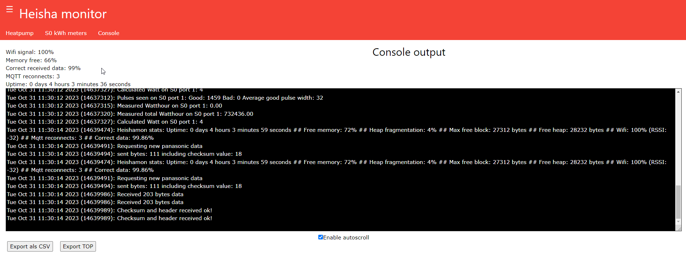

# Heishamon Export UserScript

Das **Heishamon Export UserScript** ist ein Skript für Tampermonkey, das den Nutzern ermöglicht, Konsolendaten von heishamon.local als CSV-Datei zu exportieren.

## Funktionsweise:

### Initialisierung:
Sobald die Webseite http://heishamon.local/ geladen wird, fügt das Skript zwei Buttons ("Export als CSV" und "Export TOP") zur Webseite hinzu.
Hinweis: Sollten Sie bei mDNS-Problemen auf Schwierigkeiten stoßen, können Sie das Userscript auch für eine direkte IP-Adresse aktivieren. Fügen Sie hierzu einfach einen weiteren `@match` Eintrag mit Ihrer bekannten IP-Adresse zum Skript hinzu, z.B. `// @match http://192.168.x.x/*`. Dadurch wird das Skript ebenfalls ausgeführt, wenn Sie über diese IP-Adresse zugreifen.

### Datenverarbeitung:
Alle Daten, die über einen WebSocket empfangen werden, werden kontinuierlich in eine interne Variable (csvData) gespeichert.

### Export-Funktionen:

- **"Export als CSV"**: Beim Klicken auf diesen Button wird der gesamte Dateninhalt von csvData als CSV-Datei heruntergeladen.
- **"Export TOP"**: Dieser Button ermöglicht das Herunterladen von Daten, die speziell den String ": received TOP" oder ": set " enthalten.
  
### Dateibenennung:
Beim Herunterladen der Daten wird die CSV-Datei mit einem spezifischen Format benannt, das das aktuelle Datum und die Uhrzeit enthält. Wenn Daten mit dem "Export TOP" Button gefiltert werden, wird "TOP_" dem Dateinamen vorangestellt.

### WebSocket-Verbindung:
Das Skript stellt eine WebSocket-Verbindung zur Quelle der Daten her. Bei Verlust der Verbindung wird automatisch alle 4 Sekunden ein erneuter Verbindungsversuch unternommen.

## Nutzungshinweise:

Dieses Skript wurde speziell für die Webseite heishamon.local entwickelt. Um es zu nutzen, installieren Sie Tampermonkey in Ihrem Browser, fügen Sie das Skript hinzu und besuchen Sie die gewünschte Webseite.

## Installation:

1. Tampermonkey Erweiterung herunterladen und installieren:
   
   [Chrome](https://chrome.google.com/webstore/detail/tampermonkey/dhdgffkkebhmkfjojejmpbldmpobfkfo?hl=de)
   
   [Firefox](https://addons.mozilla.org/de/firefox/addon/tampermonkey/)
   
3. 
4. Scriptcode reinkopieren
5. Datei speichern (Strg + S)
6. [http://heishamon.local/](http://heishamon.local/) aufrufen!

